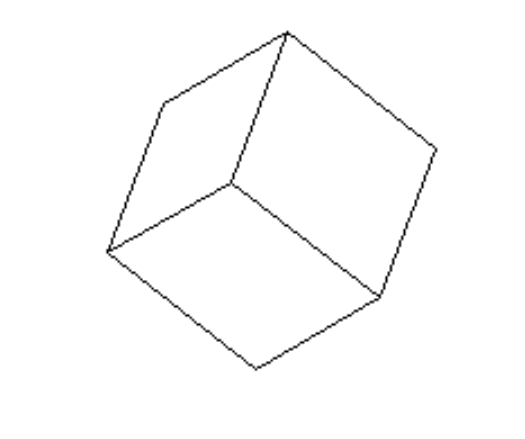
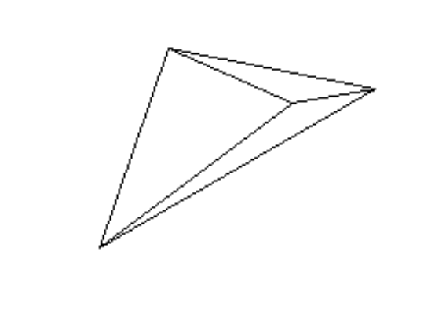

---
lang: ru
author: 
- Д.А. Ткач
- Е.А. Роганов
- А.И. Александров
date: 01.05.2024
title: Отчёт о модификации проекта «Изоюражение проекции полиэдра»
...

## Постановка задачи

> Назовём точку в пространстве «хорошей», если она находится на расстоянии 
> строго меньше $1$ от плоскости $x = 2$. Модифицируйте эталонный проект таким
> образом, чтобы определялась и печаталась следующая характеристика полиэдра: 
> сумма длин проекций рёбер, оба из концов которых — «хорошие» точки.

## Основная идея решения

Точка будет являться «хорошей», если её абсцисса удовлетворяет неравенству:
$$ |x - 2| < 1. $$
Если оба конца ребра являются хорошими точками, то сумма длин проекций его 
рёбер это сумма координат вектора, проведённого из одного конца к другому, взятая по 
модулю.

### Основные изменения в коде

1. В конструктор класса `R3` определяется расстояние до плоскости $x = 2$ и в
   переменную `good` записывается значение `True/False` --- является ли точка 
   хорошей.
2. В класс `R3` добавлен метод sum_cords суммирующий абсолютное значение
   координат вектора.
3. Добавлены методы `__eq__` и `__hash__`, для того, чтобы работать с
   множеством.
4. В конструкторе класса `Edge` определяется является ли ребро хорошим.
5. В класс `Edge` также добавлены функции `__eq__` и `__hash__`.
6. В конструкторе класса `Polyedr` создаётся множество рёбер полиэдра, чтобы
   учитывать каждое ребро ровно 1 раз.
7. Так как коэффициент гомотетии и угол поворота не влияют на сумму длин 
   проекций рёбер, то в классе `Polyedr` создаётся два списка --- для хранения
   исходных координат вершин и координат, учитывая гомотетию и поворот. 

### Пример тестов

Куб, у которого 4 хорошие вершины и 4 хороших ребра.

~~~{.py include="tests/cube_test.py"}
~~~

Пирамида с одним хорошим ребром.

~~~{.py include="tests/pyramid_test.py"}
~~~